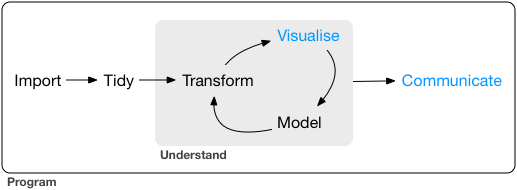

# Introduction

So far, you’ve learned the tools to get your data into R, tidy it into a form convenient for analysis, and then understand your data through transformation, visualisation and modelling. However, it doesn’t matter how great your analysis is unless you can explain it to others: you need to **communicate** your results.

Communication is the theme of the following four chapters:

- In [Markdown](), you will learn about Markdown, a tool for integrating prose, code, and results. You can use Markdown in Jupyter/Colab notebooks mode for analyst-to-analyst communication, and in report mode for analyst-to-decision-maker communication. Thanks to the power of Jupyter formats, you can even use the same document for both purposes.

- In Graphics for communication, you will learn how to take your exploratory graphics and turn them into expository graphics, graphics that help the newcomer to your analysis understand what’s going on as quickly and easily as possible.

- In Markdown formats, you’ll learn a little about the many other varieties of outputs you can produce using Markdown, including dashboards, websites, and books.

We’ll finish up with Markdown workflow and Github, where you’ll learn about the “analysis notebook” and how to systematically record your successes and failures so that you can learn from them.

Unfortunately, these chapters focus mostly on the technical mechanics of communication, not the really hard problems of communicating your thoughts to other humans. However, there are lot of other great books about communication, which we’ll point you to at the end of each chapter.
